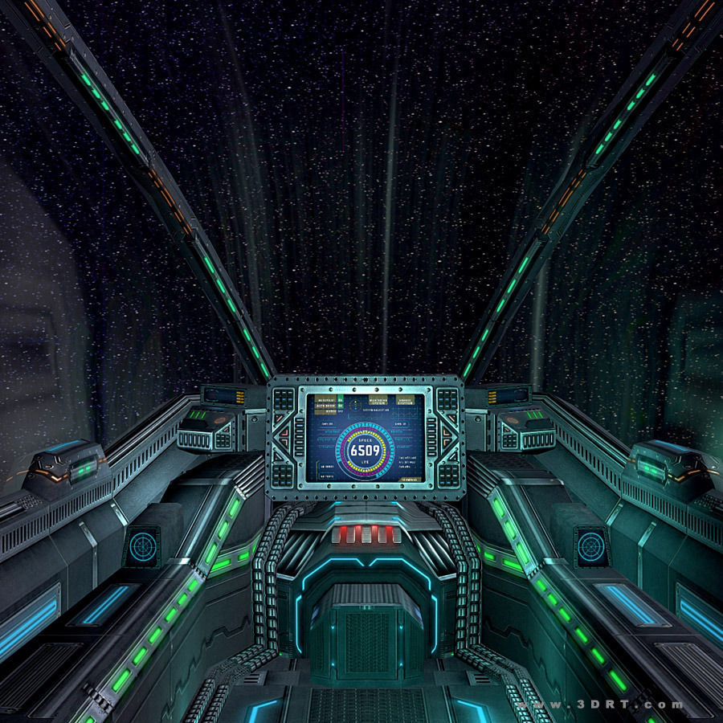

# SciFi UI Project

Name: Ross MacWilliam

Student Number: C17407712

# Description of the assignment

As part of our end of year assignment it was up to us to create a SciFi inspired interface, and by doing so we had to show ability to uderstand the concepts of polymorphism, abstraction and inheritance.

I decided to create the layout of a cockpit of a Space Aircraft moving through a starfield. There are laser shooters at either side of the screen that shoot lasers into the field and take out the planets. There are also different gadgets found inside the cockpit such as a Target System, Audio Pad, Speed/Rev Meters and Steering Wheel to name a few.

### Example of Inheritance and Abstraction

One example of inheritance in my code is with my Meter class as I used the rotation matrix in the super class Meter.java,
and I allowed the two sub classes RevMeter.java and SpeedMeter.java to inherite all of the getters, setters, and fields etc.

```Java
import processing.core.PVector; 

public abstract class Meter
{
    UI ui;
    public float x;
    public float y;
    public float diameter;
    public PVector pos;
    public PVector forward;
    public float rotation;

    public Meter(UI ui, float x, float y, float diameter)
    {
        this.ui = ui;
        this.x = x;
        this.y = y;
        pos = new PVector(x, y);
        forward = new PVector(0, -1);
        this.diameter = diameter;
    }

```

The RevMeter is able to inherite all of the variables set by the super class.

```Java
public class RevMeter extends Meter
{
    public RevMeter(UI ui, float x, float y, float diameter)
    {
        super(ui, x, y, diameter);
    }

```

# Instructions
The controls are as follows:

The buttons 'W', 'S', 'A' and 'D' will move the ship around the space field.

Space Bar will speed up the ship

Pressing the mouse will shoot lasers from the canons

Also there is an AudioPad on the cockpit that will pick up sounds from the microphone.


# How it works
Stars and planets will continuously come towards the user as they traverse the starfield. 
It is the job of the user to take out as much as the planets as possible to accumulate the highest score.

# What I am most proud of in the assignment
I am most proud of the removal of planets from the screen as it was the code I that I had to work the hardest on.
Although the code for it was very straight forward I had difficulty trying to work out why the dist() would 
not work correctly for me. After a lot of trouble shooting I worked out it was the translation that was my issue.

When I translated the planets using the dist() function it wasn't working properly and I worked out that mouseX and mouseY
don't get translated so I needed to make my own variables that translated them for me

```Java
float mx = mouseX - (width / 2);
float my = mouseY - (height / 2);
```

This allowed my mouse to be at the same position as the planets when clicking on the screen to remove them


```Java
public void mousePressed()
{
    //Mouse doesn't translate so this translates it for it
    float mx = mouseX - (width / 2);
	float my = mouseY - (height / 2);
	
    //Removes planets from ArrayList if clicked
    pushMatrix();
    translate(width/2, height/2);
    for(int i = 0 ; i < planets.size() ; i ++)
    {
        Planet p = planets.get(i);
                    
        if(dist(p.getSx(), p.getSy(), mx, my) <=  p.getR())
        {
            planets.remove(i);
            score = score + 1;
        }            
    } 
    popMatrix();    
}
```

# User Interface ScreenShot
This is a picture of an image that I based my user interface off.




This is a youtube video of my assignment:

[](https://youtu.be/xd7LGK6fpHY)

| Java File | Description |
|-----------|-----------|
|AlienPad | This file displays the mini targeting system on the cockpit. It tracks the mouse and maps it to the rectangle |
|AudioPad | It takes in the audio from the mic on the laptop and displays it as audio waves. |
|CockPit | This file draws the cockpit of the ship |
|Lever | This is the code used for the lever of the ship to move the ship up and down through the starfield |
|Meter | This is an abstract class for the two meter classes. This holds the render function and allows the two meters to rotate. |
|Planet | This is the file that fills the Planet ArrayList and is an abstarct class for each colour planet. This code is very similar to Stars.java |
|RevMeter | This is one of the subclasses for Meter and rotates continuously similar to an actual RPM meter  |
|SpeedMeter | Similar to the RevMeter class, this is also a subclass of Meter and rotates similar to an actual speedometer in a car. |
|Stars | Like the planet file these are the stars that populate the starfield. I did not use an array list for this however. |
|Static | This is a square filled with miniture squares inside that changes hues of grey to appear as static while in hyperspeed. |
|SteeringWheel | SteeringWheel is used to render and update the steering wheel on the cockpit. It rotates left and right as you turn in the starfield. |
|TargetSystem | The target on the interface is rendered in this class as it follows the mouseX and mouseY coordinates. |

