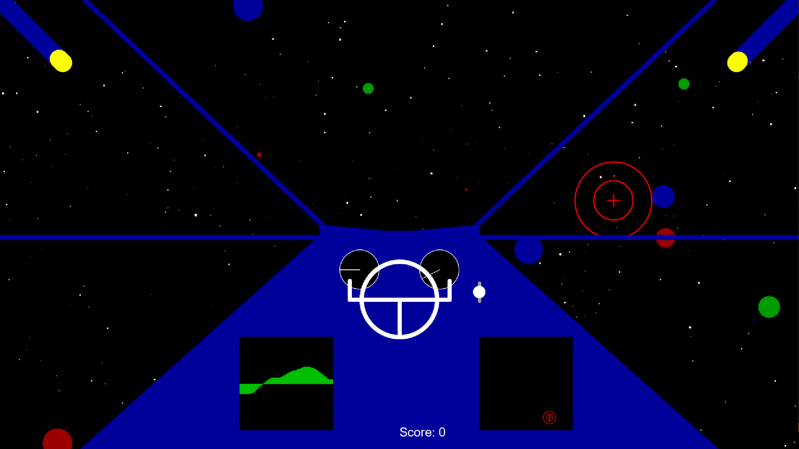

# SciFi UI Project

Name: Ross MacWilliam

Student Number: C17407712

# Description of the assignment

My interface is the cockpit of a Space Aircraft moving through a starfield along with planets.

There are laser shooters at either side of the screen that shoot lasers into the field and take out the planets.

# Instructions
The controls are as follows:

The buttons 'W', 'S', 'A' and 'D' will move the ship around the space field.

Space Bar will speed up the ship

Pressing the mouse will shoot lasers from the canons

Also there is an AudioPad on the cockpit that will pick up sounds from the microphone.


# How it works
Stars and planets will continuously come towards the user as they traverse the starfield. 
It is the job of the user to take out as much as the planets as possible to accumulate the highest score.

# What I am most proud of in the assignment
I am most proud of the removal of planets from the screen as it was the code I had the hardest time with.
Although the code for it was very straight forward I had difficulty trying to work out why the dist() would 
not work correctly for me. After a lot of trouble shooting I worked out it was the translation that was my issue.

When I translated the planets using the dist() function it wasn't working properly and I worked out that mouseX and mouseY
don't get translated so I needed to make my own variables that translated them for me

```Java
float mx = mouseX - (width / 2);
float my = mouseY - (height / 2);
```

This allowed my mouse to be at the same position as the planets when clicking on the screen to remove them


```Java
public void mousePressed()
{
    //Mouse doesn't translate so this translates it for it
    float mx = mouseX - (width / 2);
	float my = mouseY - (height / 2);
	
    //Removes planets from ArrayList if clicked
    pushMatrix();
    translate(width/2, height/2);
    for(int i = 0 ; i < planets.size() ; i ++)
    {
        Planet p = planets.get(i);
                    
        if(dist(p.getSx(), p.getSy(), mx, my) <=  p.getR())
        {
            planets.remove(i);
            score = score + 1;
        }            
    } 
    popMatrix();    
}
```


# Markdown Tutorial

This is *emphasis*

This is a bulleted list

- Item
- Item

This is a numbered list

1. Item
1. Item

This is a [hyperlink](http://bryanduggan.org)

# Headings
## Headings
#### Headings
##### Headings

This is code:

```Java
public void render()
{
	ui.noFill();
	ui.stroke(255);
	ui.rect(x, y, width, height);
	ui.textAlign(PApplet.CENTER, PApplet.CENTER);
	ui.text(text, x + width * 0.5f, y + height * 0.5f);
}
```

So is this without specifying the language:

```
public void render()
{
	ui.noFill();
	ui.stroke(255);
	ui.rect(x, y, width, height);
	ui.textAlign(PApplet.CENTER, PApplet.CENTER);
	ui.text(text, x + width * 0.5f, y + height * 0.5f);
}
```

This is an image using a relative URL:
This is an image of the interface I have designed for my Assignment.



This is an image using an absolute URL:


This is a youtube video:

[](https://www.youtube.com/watch?v=J2kHSSFA4NU)

This is a table:

| Heading 1 | Heading 2 |
|-----------|-----------|
|Some stuff | Some more stuff in this column |
|Some stuff | Some more stuff in this column |
|Some stuff | Some more stuff in this column |
|Some stuff | Some more stuff in this column |

